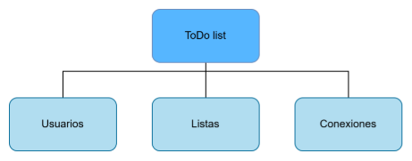



**DOCUMENTO DE ESPECIFICACIÓN DE REQUERIMIENTOS**

**ToDo list**

Luis Miguel Ossa Arias

14 de febrero del 2025

Proyecto personal

**Índice**

**1. Introducción**

1\.1. Alcance

1\.2. Definiciones, acrónimos y abreviaciones

1\.3. Referencias

**2. Descripción general**

2\.1. Funciones del producto

2\.2. Formato bicolumnar para los casos de uso de la plataforma

2\.2.1. Casos de uso correspondientes al subsistema de Usuarios

2\.2.2. Casos de uso correspondientes al subsistema Listas

2\.2.3. Casos de uso correspondientes al subsistema Conexiones

2\.3. Diagrama de casos de uso

2\.4. Suposiciones

2\.4. Requerimientos futuros

**3. Especificación de requerimientos funcionales**

3\.1. Funciones

3\.1.1. Usuarios (USER)

3\.1.2. Listas (LIST)

3\.1.3. Conexiones (LINK)

**4. Especificación de requerimientos no funcionales**

**5. Anexos**

5\.1. Método de Dorfman

5\.1.1. Particionamiento de primer nivel

5\.1.2. Asignación de primer nivel

5\.2. Prototipo

5\.4. Diagrama de Clases

5\.5. Diagrama de secuencia

5\.6. Diseño de pruebas aplicando técnicas de caja negra.

5\.6.1. Pantalla para realizar comentarios o sugerencias

5\.6.2. Pantalla de editar perfil de egresado

5\.6.3. Pantalla de crear encuesta

5\.6.4. Pantalla de crear publicación

1. **Introducción**
**\

**\
`	`En el presente documento se realizará la especificación y análisis de requerimientos del proyecto titulado “ToDo list”. Asimismo, se presentará un prototipo del proyecto, en conjunto con un modelo de datos y anexos relacionados con la técnica de elicitación de requerimientos seleccionada.

1. **Alcance**

Se desarrollará una aplicación donde el usuario necesita poder crear diferentes listas de diferentes tipos. Debería poder crear listas de lo que quiera. Además, debería de poder buscar entre sus listas por texto, fecha de creación, fecha de para cumplirla si tiene, etc. También quiere que se puedan crear listas compartidas para usar en conjunto con otras personas. También le gustaría ver cuál es el progreso de cumplimiento de sus listas, como una gráfica de líneas especificando las diferentes listas que tenga activas. También le gustaría clasificar sus tareas con algún tipo como: importante, hoy, destacado, y otros que quiera crear. El usuario espera poder usar la aplicación tanto en dispositivos móviles como computadores. Es necesario que inicie sesión para ingresar a ver sus listas. Como necesita crear listas compartidas, se espera que el celular pueda leer códigos QR para ingresar una lista compartida y/o enviar links de conexión para la aplicación de computador y celular.

1. **Definiciones, acrónimos y abreviaciones**
- **QR:** módulo que sirve para guardar información como un código de barras bidimensional.
- **Link:** vínculo unidireccional que sirve para visitar una página o elemento web.
  1. **Referencias**
- Colaboradores de Wikipedia. (2025, 5 febrero). *Código QR*. Wikipedia, la Enciclopedia Libre. <https://es.wikipedia.org/wiki/C%C3%B3digo_QR>
- Equipo editorial, Etecé. (2023, 19 noviembre). *¿Qué es un Link? - Tipos, para qué sirve y cómo se señala*. Concepto. <https://concepto.de/link/>
- Gunda, S. G. (2008). “Requirements engineering: elicitation techniques (Dissertation)”. Obtenido de <http://urn.kb.se/resolve?urn=urn:nbn:se:hv:diva-596>
- Borque, P., & Fairley, R. (2014). “Guide to the Software Engineering Body of Knowledge Version 3.0”. IEEE Computer Society Staff.
- Dorfman, M (1997). “Requirements Engineering”. Los Alamitos, California
1. **Descripción general**

**2.1. Funciones del producto**

- Crear listas de cualquier tipo y contenido.
- Buscar listas por texto, fecha de creación o fecha de cumplimiento.
- Crear y compartir listas con otras personas.
- Ingresar a listas compartidas con códigos QR o enlaces.
- Ver el progreso de cumplimiento con una gráfica de líneas.
- Clasificar tareas con etiquetas como importante, hoy, destacado, etc.
- Usar la aplicación en móvil y computadora.
- Iniciar sesión para acceder a las listas.
- Cerrar sesión.

**2.2. Formato bicolumnar para los casos de uso de la plataforma**

**2.2.1. Casos de uso correspondientes al subsistema de Usuarios**

|**ID**|TDL\_CREAR\_CUENTA\_USER||
| :- | :- | :- |
|**Autor**|Luis Miguel Ossa Arias||
|**Caso de uso**|Crear cuenta||
|**Casos de uso relacionados**|||
|**Actor**|Usuario||
|**Precondición**|El usuario debe tener un correo electrónico creado con anterioridad||
|**Contexto**|`  `Un usuario desea crear una cuenta en la plataforma de ToDo List||
|**Acciones del usuario**|
**Acciones del sistema**

**(Incluye flujo normal y excepciones)**
||
|1. El usuario elige la opción “Crear cuenta” en la plataforma.|2. ` `El sistema muestra la pantalla “Crear cuenta”.||
|3. El usuario ingresa su correo electrónico junto con una contraseña y la confirmación de la contraseña. Además ingresa su nombre completo y un nombre de usuario|
4. El sistema valida el diligenciamiento obligatorio de los campos.

&emsp;**4.1.**  	Excepción - Campos no diligenciados: El sistema informa al usuario sobre los campos vacíos (vuelve al paso 3).
||
||
5. El sistema valida:

&emsp;5.1. Si el correo ingresado no existe en la base de datos.

&emsp;5.2. Si las contraseñas coinciden.

&emsp;5.3. Si el nombre de usuario está disponible.

&emsp;5.4. Excepción - Campos no diligenciados: El sistema informa al usuario sobre los campos vacíos (vuelve al paso 3).

&emsp;5.5. Excepción - Campos no válidos: El sistema informa al usuario sobre los campos no válidos (vuelve al paso 3).
||
||6. El sistema muestra la pantalla principal de la aplicación.||
|**Poscondición**|El usuario ha creado una cuenta exitosamente.||
|**Observaciones:** |||

|**ID**|TDL\_INICIAR\_SESIÓN\_USER||
| :- | :- | :- |
|**Autor**|Luis Miguel Ossa Arias||
|**Caso de uso**|Iniciar sesión ||
|**Casos de uso relacionados**|||
|**Actor**|Usuario||
|**Precondición**|El usuario debe tener una cuenta creada con anterioridad||
|**Contexto**|`  `Un usuario desea iniciar sesión en la plataforma de ToDo List||
|**Acciones del usuario**|
**Acciones del sistema**

**(Incluye flujo normal y excepciones)**
||
|1. El usuario elige la opción “Iniciar Sesión” en la plataforma.|2. ` `El sistema muestra la pantalla de inicio de sesión.||
|3. El usuario ingresa su correo y contraseña.|
4. El sistema valida el diligenciamiento obligatorio de los campos.

&emsp;**4.1.**  	Excepción - Campos no diligenciados: El sistema informa al usuario sobre los campos vacíos (vuelve al paso 1).

&emsp;**4.2**       Excepción - Correo o contraseña incorrectos: El sistema informa al usuario sobre el correo o contraseña incorrectos (vuelve al paso 3).
||
||5. El sistema muestra la pantalla principal de la aplicación.||
|**Poscondición**|El usuario ha iniciado sesión exitosamente.||
|**Observaciones:** |||

|**ID**|TDL\_TERMINAR\_SESIÓN\_USER||
| :- | :- | :- |
|**Autor**|Luis Miguel Ossa Arias||
|**Caso de uso**|Terminar sesión ||
|**Casos de uso relacionados**|||
|**Actor**|Usuario||
|**Precondición**|El usuario debe tener una cuenta creada con anterioridad y haber iniciado sesión en la cuenta||
|**Contexto**|`  `Un usuario desea terminar sesión en la plataforma de ToDo List||
|**Acciones del usuario**|
**Acciones del sistema**

**(Incluye flujo normal y excepciones)**
||
|1. El usuario elige la opción “Terminar Sesión” en la plataforma.|2. ` `El sistema muestra la pantalla de inicio de sesión.||
|**Poscondición**|El usuario ha terminado sesión exitosamente.||
|**Observaciones:** |||

|**ID**|TDL\_EDITAR\_NICKNAME\_USER||
| :- | :- | :- |
|**Autor**|Luis Miguel Ossa Arias||
|**Caso de uso**|Cambio del nombre de usuario||
|**Casos de uso relacionados**|||
|**Actor**|Usuario||
|**Precondición**|El usuario debe tener una cuenta creada con anterioridad y haber iniciado sesión en la cuenta||
|**Contexto**|`  `Un usuario desea cambiar el nombre de usuario que se despliega a otros usuarios en la plataforma de ToDo List||
|**Acciones del usuario**|
**Acciones del sistema**

**(Incluye flujo normal y excepciones)**
||
|1. El usuario elige la opción “Editar perfil” en la plataforma.|2. ` `El sistema muestra la pantalla para editar el perfil.||
|3. El usuario escribe su nuevo nombre de usuario|
4. El sistema valida que sea un nombre de usuario diferente al actual y verifica si está disponible

&emsp;4.1. Excepción - nombre inválido por caracteres especiales (vuelve al paso 3)

&emsp;4.2. Excepción - nombre es igual al actual (vuelve al paso 3)

&emsp;4.3. Excepción - nombre de usuario no disponible (vuelve al paso 3)
||
|5. El usuario presiona el botón “Actualizar”.|6. El sistema guarda y muestra el nuevo nombre de usuario.||
|**Poscondición**|El usuario ha terminado sesión exitosamente.||
|**Observaciones:** |||

**2.2.2. Casos de uso correspondientes al subsistema Listas**

|**ID**|TDL\_CREAR\_LISTA\_LIST||
| :- | :- | :- |
|**Autor**|Luis Miguel Ossa Arias||
|**Caso de uso**|El usuario quiere crear una lista||
|**Casos de uso relacionados**|||
|**Actor**|Usuario||
|**Precondición**|El usuario debe tener una cuenta creada con anterioridad y haber iniciado sesión en la cuenta||
|**Contexto**|`  `Un usuario desea crear una lista nueva en la plataforma de ToDo List||
|**Acciones del usuario**|
**Acciones del sistema**

**(Incluye flujo normal y excepciones)**
||
|1. El usuario elige la opción “+” en la plataforma.|2. El sistema muestra la opción para crear la nueva lista||
|3. El usuario escribe el nombre para la lista|||
|4. El usuario presiona el botón “guardar” o enter.|5. El sistema guarda y muestra la nueva lista.||
|**Poscondición**|El usuario ha creado una lista exitosamente.||
|**Observaciones:** |||

|**ID**|TDL\_EDITAR\_LISTA\_LIST||
| :- | :- | :- |
|**Autor**|Luis Miguel Ossa Arias||
|**Caso de uso**|El usuario quiere cambiar el color de una lista||
|**Casos de uso relacionados**|||
|**Actor**|Usuario||
|**Precondición**|El usuario debe tener una cuenta creada con anterioridad y haber iniciado sesión en la cuenta. Además es necesario que la lista esté creada.||
|**Contexto**|`  `Un usuario desea editar el color de una lista en la plataforma de ToDo List||
|**Acciones del usuario**|
**Acciones del sistema**

**(Incluye flujo normal y excepciones)**
||
|1. El usuario elige una lista|2. El sistema muestra la información de la lista||
|3. El usuario presiona el botón “Editar” presente en las listas|4. El sistema muestra la pantalla “Editar lista”||
|5. El usuario selecciona un color para la lista|6. El sistema guarda el color de la lista.||
|**Poscondición**|El usuario ha editado una lista exitosamente.||
|**Observaciones:** |||

|**ID**|TDL\_CREAR\_LISTA\_LIST||
| :- | :- | :- |
|**Autor**|Luis Miguel Ossa Arias||
|**Caso de uso**|El usuario quiere cambiar el color de una lista||
|**Casos de uso relacionados**|||
|**Actor**|Usuario||
|**Precondición**|El usuario debe tener una cuenta creada con anterioridad y haber iniciado sesión en la cuenta. Además es necesario que la lista esté creada.||
|**Contexto**|`  `Un usuario desea editar el color de una lista en la plataforma de ToDo List||
|**Acciones del usuario**|
**Acciones del sistema**

**(Incluye flujo normal y excepciones)**
||
|7. El usuario elige una lista|8. El sistema muestra la información de la lista||
|9. El usuario presiona el botón “Editar” presente en las listas|10. El sistema muestra la pantalla “Editar lista”||
|11. El usuario selecciona un color para la lista|12. El sistema guarda el color de la lista.||
|**Poscondición**|El usuario ha editado una lista exitosamente.||
|**Observaciones:** |||

|**ID**|TDL\_CREAR\_TAREA\_LIST||
| :- | :- | :- |
|**Autor**|Luis Miguel Ossa Arias||
|**Caso de uso**|El usuario quiere crear una tarea en una lista.||
|**Casos de uso relacionados**|||
|**Actor**|Usuario||
|**Precondición**|El usuario debe tener una cuenta creada con anterioridad y haber iniciado sesión en la cuenta. Además es necesario que la lista esté creada.||
|**Contexto**|`  `Un usuario desea crear una tarea de una lista en la plataforma de ToDo List||
|**Acciones del usuario**|
**Acciones del sistema**

**(Incluye flujo normal y excepciones)**
||
|1. El usuario presiona el botón “+” de una lista.|2. El sistema muestra la pantalla para crear una nueva tarea||
|3. El usuario ingresa el nombre de la tarea y opcionalmente ingresa una fecha. Opcionalmente puede agregar una categoría a la tarea.|4. El sistema guarda la nueva tarea y la muestra en la lista.||
|**Poscondición**|El usuario ha creado una tarea en una lista exitosamente.||
|**Observaciones:** |||

|**ID**|TDL\_CREAR\_CATEGORÍA\_LIST||
| :- | :- | :- |
|**Autor**|Luis Miguel Ossa Arias||
|**Caso de uso**|El usuario quiere crear una categoría para las tareas de una lista.||
|**Casos de uso relacionados**|||
|**Actor**|Usuario||
|**Precondición**|El usuario debe tener una cuenta creada con anterioridad y haber iniciado sesión en la cuenta.||
|**Contexto**|`  `Un usuario desea crear una categoría para las tareas de una lista en la plataforma de ToDo List||
|**Acciones del usuario**|
**Acciones del sistema**

**(Incluye flujo normal y excepciones)**
||
|1. El usuario presiona el botón “+”.|2. El sistema muestra la pantalla para crear una nueva categoría||
|3. El usuario ingresa el nombre de la categoría.|
4. El sistema valida que la categoría no esté creada anteriormente

&emsp;4.1. Excepción - la categoría ya existe.
||
|5. El usuario selecciona el color de la categoría|||
|6. El usuario presiona el botón “Guardar”.|7. El sistema guarda la nueva categoría.||
|**Poscondición**|El usuario ha creado una categoría exitosamente.||
|**Observaciones:** |||

|**ID**|TDL\_MOSTRAR\_LISTAS\_LIST||
| :- | :- | :- |
|**Autor**|Luis Miguel Ossa Arias||
|**Caso de uso**|El usuario quiere ver las listas que ha creado.||
|**Casos de uso relacionados**|||
|**Actor**|Usuario||
|**Precondición**|El usuario debe tener una cuenta creada con anterioridad y haber iniciado sesión en la cuenta. Además, es necesario que tenga por lo menos una lista creada.||
|**Contexto**|`  `Un usuario desea ver las listas que ha creado en la plataforma de ToDo List||
|**Acciones del usuario**|
**Acciones del sistema**

**(Incluye flujo normal y excepciones)**
||
|1. **El usuario presiona el botón “Listas”**|2. El sistema muestra las listas que el usuario ha creado.||
|**Poscondición**|El usuario ha visualizado sus listas exitosamente.||
|**Observaciones:** |||

|**ID**|TDL\_FILTRAR\_LISTAS\_LIST||
| :- | :- | :- |
|**Autor**|Luis Miguel Ossa Arias||
|**Caso de uso**|El usuario quiere filtrar las listas que ha creado.||
|**Casos de uso relacionados**|TDL\_MOSTRAR\_LISTAS\_LIST||
|**Actor**|Usuario||
|**Precondición**|El usuario debe tener una cuenta creada con anterioridad y haber iniciado sesión en la cuenta. Además, es necesario que tenga por lo menos dos listas de diferente categoría creadas.||
|**Contexto**|`  `Un usuario desea filtrar las listas que ha creado en la plataforma de ToDo List||
|**Acciones del usuario**|
**Acciones del sistema**

**(Incluye flujo normal y excepciones)**
||
|1. El usuario escribe en la barra de búsqueda de las listas el título de una lista.|2. El sistema muestra la lista que tenga un título parecido o similar al que ingresó.||
|**Poscondición**|El usuario ha filtrado sus listas exitosamente.||
|**Observaciones:** |||

|**ID**|TDL\_PROGRESO\_LIST||
| :- | :- | :- |
|**Autor**|Luis Miguel Ossa Arias||
|**Caso de uso**|El usuario quiere ver la sección de progreso de las listas.||
|**Casos de uso relacionados**|||
|**Actor**|Usuario||
|**Precondición**|El usuario debe tener una cuenta creada con anterioridad y haber iniciado sesión en la cuenta. Además, es necesario que tenga por lo menos una lista creada con tareas completadas.||
|**Contexto**|`  `Un usuario desea ver el progreso de sus tareas y listas en la plataforma de ToDo List||
|**Acciones del usuario**|
**Acciones del sistema**

**(Incluye flujo normal y excepciones)**
||
|1. El usuario presiona el botón “Progreso”|2. El sistema muestra la sección de progreso||
|**Poscondición**|El usuario ha visto el progreso de sus listas exitosamente.||
|**Observaciones:** |||

**2.2.3. Casos de uso correspondientes al subsistema Conexiones**

|**ID**|TDL\_LISTA\_COMPARTIDA\_LINK||
| :- | :- | :- |
|**Autor**|Luis Miguel Ossa Arias||
|**Caso de uso**|El usuario quiere crear una lista compartida con otro usuario.||
|**Casos de uso relacionados**|||
|**Actor**|Usuario||
|**Precondición**|El usuario debe tener una cuenta creada con anterioridad y haber iniciado sesión en la cuenta. Además, es necesario que tenga por lo menos una lista creada.||
|**Contexto**|`  `Un usuario quiere crear una lista compartida en la plataforma de ToDo List||
|**Acciones del usuario**|
**Acciones del sistema**

**(Incluye flujo normal y excepciones)**
||
|1. El usuario presiona el botón “compartir”|2. El sistema despliega una ventana que contiene un link para compartir la lista y un código QR.||
|3. El usuario envía el link o el código QR |||
|4. El otro usuario usa el link|5. El sistema muestra la misma lista que tiene el usuario que le mandó el link.||
|**Poscondición**|El usuario ha creado una lista compartida exitosamente.||
|**Observaciones:** |||

**2.3. Diagrama de casos de uso**

[Diagrama de casos de uso](https://drive.google.com/file/d/1OCkYiBexYVl9ov9uqMHZRCarZ_am7C1Q/view?usp=sharing)

2\.4. Suposiciones

`	`Para el funcionamiento de la aplicación, es necesario que los usuarios tengan un correo electrónico creado.

2\.5. Requerimientos futuros

Para versiones futuras, se puede hacer una integración en conjunto con WhatsApp y otras aplicaciones para compartir los elementos para invitar a otras personas a las listas compartidas.

1. ` `**Especificación de requerimientos funcionale**

   1. **Usuarios (USER)**

**	El sistema tiene que estar en la capacidad de:

`	`**USER\_R1.** Permitir a un **usuario** crear una cuenta.

`	`**USER\_R2.** Permitir a un **usuario** iniciar sesión en la aplicación.

`	`**USER\_R3.** Permitir a un **usuario** terminar sesión en la aplicación.

**USER\_R4.** Personalizar el perfil, como cambiar foto de perfil, nickname y datos personales tales como:

- Nombres
- Apellidos
- Correo

1. **Listas (LIST)**

`	`El sistema tiene que estar en la capacidad de:

`	`**LIST\_R1.** Crear listas.

`	`**LIST\_R2.** Cambiar el color de las listas.

`	`**LIST\_R3.** Crear tareas en una lista determinada.

**LIST\_R4.** Crear tipos de tareas para poder marcar los elementos dentro de las listas como:

- Importante
- Hoy
- Destacado

`	`**LIST\_R5.** Mostrar las listas de las que haga parte.

`	`**LIST\_R6.** Filtrar las listar por:

- Texto
- Fecha de creación
- Fecha de cumplimiento si tiene
- Etc.

`	`**LIST\_R7.** Ver el progreso de sus listas en formato de gráfica de líneas.

**LIST\_R8.** Ver la cantidad de listas y tareas creadas, así como la cantidad de tareas completadas de estas listas en formato de gráfico de barras.

1. ` `**Conexiones (LINK)**

`	`El sistema tiene que estar en la capacidad de:

`	`**LINK\_R1.** crear listas compartidas entre usuarios.

`	`**LINK\_R2.** crear códigos QR para las listas compartidas.

**LINK\_R3.** crear links para las listas compartidas.

1. **Especificación de requerimientos no funcionales**

   **R1.** El sistema debe estar en la capacidad de funcionar tanto en dispositivos móviles como en computadores.

1. **Anexos**
   1. **Método de Dorfman**
      1. **Particionamiento de primer nivel**

**Objetivos de cada subsistema**

- **Usuarios:** se encarga de gestionar todos los elementos relacionados con los usuarios, como los son los permisos y funcionalidades directamente conectados con los usuario.

- **Listas:** busca tener todas las funcionalidades de las listas como crear, editar eliminar entre otras para que puedan ser utilizadas por los usuarios.

- **Conexiones:** este módulo se encuentra encargado de crear las conexiones tanto entre las listas como entre los usuario, como también de las conexiones presentes para compartir link y otros elementos para usar las listas compartidas.

  1. **Asignación de primer nivel**

|**Requerimiento**|**Usuarios**|**Listas**|**Conexiones**|
| :- | :- | :- | :- |
|**USER\_R1**|X|||
|**USER\_R2**|X|||
|**USER\_R3**|X|||
|**USER\_R4**|X|||
|**LIST\_R1**||X||
|**LIST\_R2**||X||
|**LIST\_R3**||X||
|**LIST\_R4**||X||
|**LINK\_R19**|||X|
|**LINK\_R2**|||X|
|**LINK\_R3**|||X|
|**LIST\_R5**||X||
|**LIST\_R6**||X||
|**LIST\_R7**||X||

1. **Prototipo**
1. **Diagrama de clases**

   Se utilizó la aplicación web plantuml para crear el diagrama. A continuación se encuentra el diagrama de clases tanto en imagen como en código:

- [Diagrama de clases](https://drive.google.com/file/d/18OvM9NntTDfE3ZIPPlu8iF1jF2539ujN/view?usp=drive_link)
- [Código plantuml](https://drive.google.com/file/d/1ZKP5YifCi-anNKAwCyV_m39iK2eXQ0Hj/view?usp=drive_link)
1. **Diagrama de secuencia**
   **\
   `	`Para el diagrama de secuencias también se utilizó la herramientas plantuml:

- [Diagrama de secuencia](https://drive.google.com/file/d/1TvEuSXcmqdf425P-J5i8NdDmstIMESVE/view?usp=drive_link)
- [Código plantuml](https://drive.google.com/file/d/1u4AHVlBgFeDbDT4Un_CBY6VNOkPMJDw0/view?usp=drive_link)
